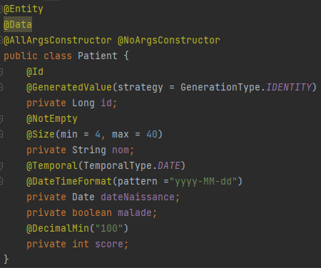
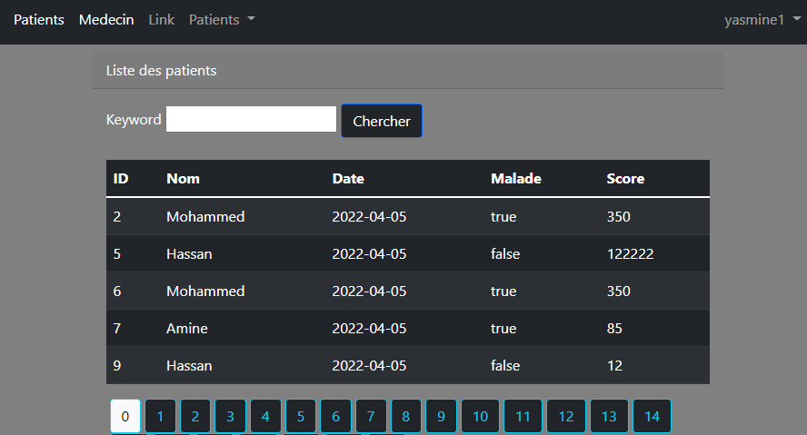
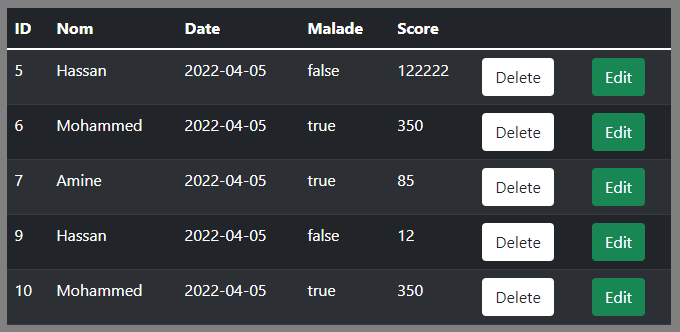
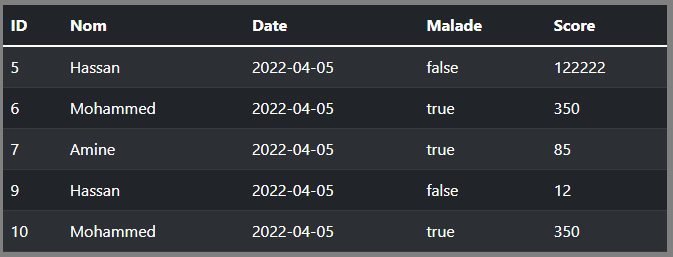
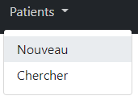
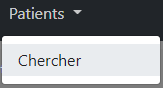

<div id="top"></div>


<br />
<div align="center">
  <a href="https://github.com/Charafeddine26/MVC-PATIENT-CHARAF">
    
  </a>

<h3 align="center">Patients-MVC</h3>

  <p align="center">
    project_description
    <br />
    <a href="https://github.com/Charafeddine26/MVC-PATIENT-CHARAF"><strong>Explore the docs »</strong></a>
    <br />
    <br />
    <a href="https://github.com/Charafeddine26/MVC-PATIENT-CHARAF">View Demo</a>
   
  </p>
</div>


<!-- TABLE OF CONTENTS -->
<details>
  <summary>Table of Contents</summary>
  <ol>
    <li>
      <a href="#about-the-project">About The Project</a>
      <ul>
        <li><a href="#built-with">Built With</a></li>
      </ul>
    </li>
    <li>
      <a href="#getting-started">Getting Started</a>
      <ul>
        <li><a href="#Prérequis">Prerequisites</a></li>
        <li><a href="#Creation du projet">Creation du projet</a></li>
      </ul>
    </li>

    <li><a href="#Developpement de l'application MVC">Developpement de l'application MVC</a></li>
<ul>
        <li><a href="#M">M </a></li>
        <li><a href="#V">V</a></li>
        <li><a href="#C">C</a></li>
      </ul>
    <li><a href="#Sécurité">Sécurité</a></li>
    <li><a href="#Contributing">Contributing</a></li>
    <li><a href="#License">License</a></li>
    <li><a href="#Contact">Contact</a></li>
    <li><a href="#References">References</a></li>
  </ol>
</details>


### Built With

* [Java](https://www.oracle.com/java/technologies/)
* [Spring boot](https://spring.io/projects/spring-boot)
* [Thymeleaf](https://www.thymeleaf.org/)
* [HTML](https://en.wikipedia.org/wiki/HTML)
* [MySQL](https://www.mysql.com/)


<p align="right">(<a href="#top">back to top</a>)</p>


<!-- GETTING STARTED -->
## Getting Started

Avant d'initier, ce projet avez pour but : nous introduire (a) Spring boot qui est un framework en Java, il permet 
de développer plus rapidement en se focalisant essentiellement sur le code métier.

### Prérequis

Pour les prérequis, il est recommendé d'utiliser `Intellij Idea`, pour profiter de l'automatisation et suggestions du code,
et l'accessibilité des plugins différents.

`MariaDB`, qui repose sur MySQL, comme un système de gestion de base de données relationnelle (SGBDR) open source.

`Thymeleaf` est un template moteur (moteur de rendu de document) écrit en Java. Principalement conçu pour produire des vues Web,
il fournit un support pour la génération de documents HTML


### Creation du projet

1. Installation de l'environnement Intellij Idea.
2. Creation du projet en respectant premièrement le type du projet étant : Spring Initializor.

 
3. Ajout des dépendances nécessaires :


   

<p align="right">(<a href="#top">back to top</a>)</p>


## Developpement de l'application MVC

### M

Comme son nom le dénonce, l'application MVC doit commencer par le modèle ou entity : Patient.

Cette dernière contient les attributs principaux d'une classe patient.
Avec implementation de `@Data` pour les getters et setters, `@AllArgsConstructor` et `@NoArgsConstructor` pour 
les constructeurs. `@Id` pour la clef primaire, et `@Entity` pour la declarer en tant qu'entité.



### V

Ensuite la creation des vues, où nous avons créé une page template qui contient les éléments utilisés à chaque fois
comme la Navbar. 

```sh
layout:decorate="template1"
```

Cette template.html est incluse dans notre premiere vue principale : patients.html, qui s'en occupe pour afficher 
un tableau de patients avec leur information plus un champ de recherche par nom du patient.



Et dernièrement, on a créé deux pages l'une pour ajouter un patient et l'autre qui sert à le modifier : editPatient.html et 
formPatient.html

 ### C

Finalement, les contrôleurs, ces derniers sont l'intermédiaire entre le modèle et la vue. Le contrôleur va demander au
modèle les données, les analyser, prendre des décisions et renvoyer le texte à afficher à la vue.

PatientController contient les méthodes : renvoyer la liste des patients, suppression, ajout, modification.
Ces méthodes se font par des modules prêts offerts par la repository JPA, exemple :

```sh
patientRepository.deleteById(id);
```

La méthode `deleteById` est incluse sur la repository CrudRepository qui fait par de la JPA.

<p align="right">(<a href="#top">back to top</a>)</p>


## Sécurité

Pour la partie sécurité ; on commence par implementer la dependence : `org.springframework.boot:spring-boot-starter-security`

La classe WebSecurityConfig est annotée avec `@EnableWebSecurity` pour activer le support de la sécurité web de Spring Security et fournir l'intégration Spring MVC.

Les services de sécurité reçoivent l'annotation
`@Configuration ` Spring demarre ces classes en premier.

Supposons que nous voulions empêcher les utilisateurs non autorisés de voir la page de modification `/editPatient` :
```sh
 http.authorizeRequests().antMatchers("/admin/**").hasAuthority("ADMIN"); 
 ```
Juste les users ayant le role "ADMIN" auront accès à ces pages.
Ce role est associé à l'utilisateur sur la classe user_roles.

Revenons à nos vues, quelques elements (Bouton edition et suppression, drop down ajout...), sont cachés à l'aide
du système d'autorisation ou authority :

```sh
<th sec:authorize="hasAuthority('ADMIN')">
```

Vue avec **admin authority**



Vue avec **user authority**



Vue avec **admin authority**



Vue avec **user authority**




<p align="right">(<a href="#top">back to top</a>)</p>


<!-- CONTRIBUTING -->
## Contributing

Si vous avez une suggestion qui permettrait d'améliorer cette application, veuillez forker le dépôt et créer une demande de téléchargement. Vous pouvez aussi simplement ouvrir un problème avec le tag "enhancement".
N'oubliez pas de donner une étoile au projet ! Merci encore !

1. Fork le projet
2. Créez votre branche Feature (`git checkout -b feature/AmazingFeature`)
3. Commit vos changements (`git commit -m 'Add some AmazingFeature'`)
4. Push vers la branche (`git push origin feature/AmazingFeature`)
5. Ouvrez une Pull Request

<p align="right">(<a href="#top">back to top</a>)</p>


## License

Distribué sous l'autorisation de [Professeur Mohamed YOUSSFI](med@youssfi.net).

<p align="right">(<a href="#top">back to top</a>)</p>


## Contact

BENERRAZAM CHARAF EDDINE - [@charaXHSAFBGSA](https://twitter.com/charaXHSAFBGSA) - cbenerrazam@gmail.com

Project Link: [https://github.com/Charafeddine26/MVC-PATIENT-CHARAF](https://github.com/Charafeddine26/MVC-PATIENT-CHARAF)

<p align="right">(<a href="#top">back to top</a>)</p>


## References

* [Part 1](https://youtu.be/Zaf3XIP2wss)
* [Part 2](https://youtu.be/eoBE745lDE0)
* [Part 3](https://youtu.be/Ejdeqs4rWek)
* [Part 4](https://youtu.be/Zrq1_-EX0XM)

<p align="right">(<a href="#top">back to top</a>)</p>


